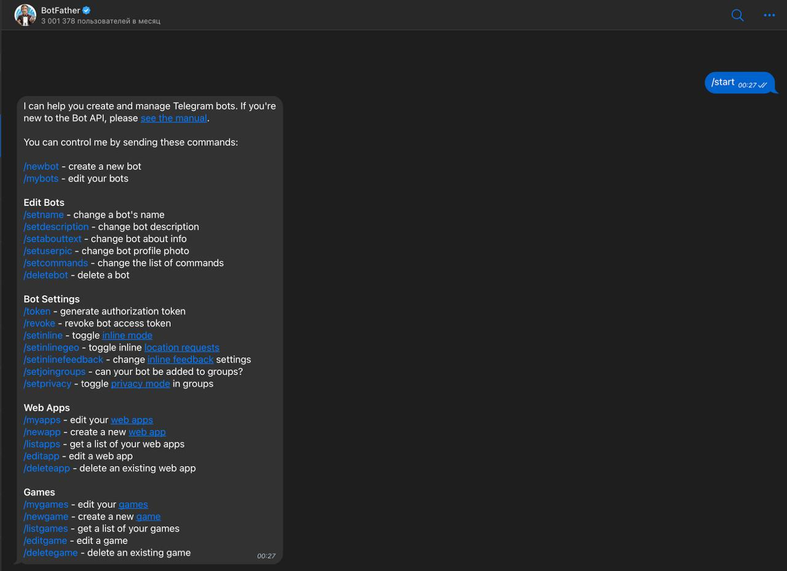
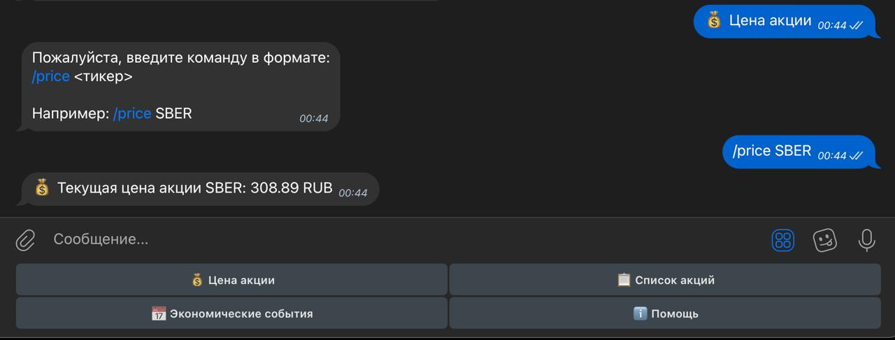
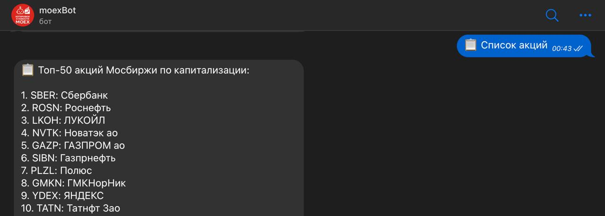
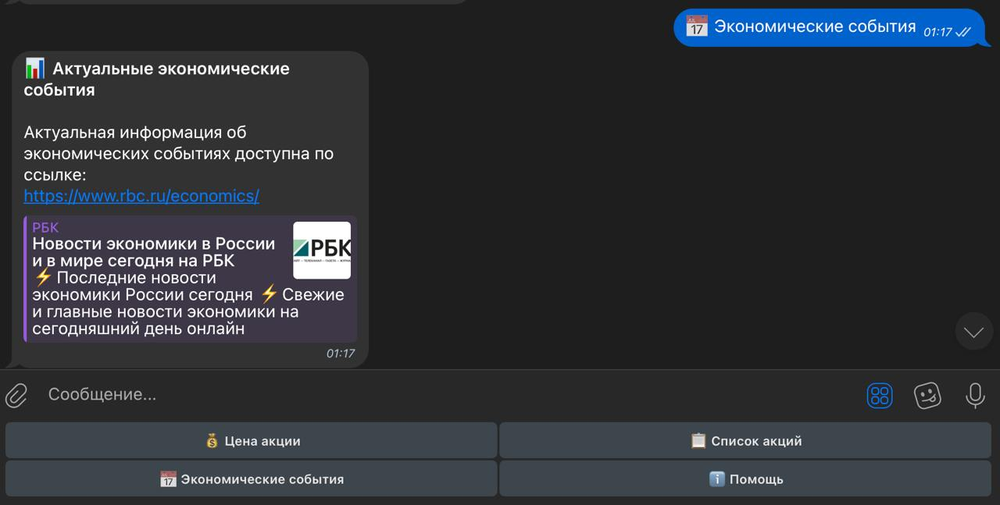

## 1. Исследование предметной области и постановка задач

### 1.1. Цель проекта
Создание Telegram-бота для получения актуальной информации о ценах акций на Московской бирже и экономических событиях.

### 1.2. Основные функции бота:
- `/start` — начало работы с ботом, приветствие
- `/help` — справка по командам
- `/price <тикер>` — получение цены акции по её тикеру
- `/list` — получение списка доступных акций
- `/events` — получение информации об экономических событиях

### 1.3. Интерфейс бота
Бот предоставляет два способа взаимодействия:
1. Текстовые команды
2. Кнопки быстрого доступа:
   -  Цена акции
   -  Список акций
   -  Экономические события
   -  Помощь

### 1.4. Интеграции
- API Московской биржи (через библиотеку apimoex)

## 2. Подготовка окружения

### 2.1. Установка Python

Для работы потребуется **Python (≥3.9)** и **pip**.

- **Windows**: скачайте Windows Installer (.msi) с [python.org](https://python.org) и установите.
- **macOS**: через Homebrew: `brew install python` или скачайте .pkg с сайта.
- **Ubuntu/Debian**:
  ```bash
  sudo apt update
  sudo apt install python3.9 python3-pip
  ```

Проверьте версии в терминале:
```bash
python3 --version  # должно быть 3.9 или выше
pip3 --version
```

### 2.2. Создание проекта

1. Создайте папку проекта и перейдите в неё:
   ```bash
   mkdir moex_bot && cd moex_bot
   ```
2. Создайте виртуальное окружение:
   ```bash
   python3 -m venv venv
   source venv/bin/activate  # для Linux/macOS
   venv\Scripts\activate     # для Windows
   ```

### 2.3. Установка зависимостей

Установите необходимые библиотеки через файл requirements.txt:
```bash
pip install -r requirements.txt
```

### 2.4. Конфигурация окружения

Создайте файл `.env` в корне проекта:
```env
BOT_TOKEN=ВАШ_ТОКЕН_БОТА
```

## 3. Регистрация бота в Telegram через BotFather

1. Откройте Telegram и найдите **@BotFather**.
2. Отправьте `/newbot`.
3. Придумайте имя (например, "MOEX Info Bot").
4. Придумайте username (должен заканчиваться на 'bot', например "moex_info_bot").
5. Получите токен и сохраните его в `.env` файл.


## 4. Структура проекта

```
moex_bot/
├── moex_bot/
│   ├── __init__.py
│   ├── bot.py           # Основной файл бота
│   ├── config.py        # Конфигурация
│   ├── handlers/        # Обработчики команд
│   │   ├── __init__.py
│   │   ├── events.py    # Обработка экономических событий
│   │   ├── list.py      # Список акций
│   │   ├── price.py     # Получение цен акций
│   │   └── start.py     # Команды start и help
│   └── services/        # Сервисные функции
│       ├── __init__.py
│       └── moex.py      # Функции для работы с API Московской биржи
├── requirements.txt     # Зависимости проекта
├── run.py              # Точка входа для запуска бота
└── .env                # Конфигурационные переменные
```

## 5. Реализация основных функций бота

### 5.1. Основной файл бота (bot.py)

```python
import logging
from telegram.ext import Application, CommandHandler, MessageHandler, filters

from .config import BOT_TOKEN

from .handlers import (
    start_command,
    price_command,
    list_command,
    events_command,
    help_command,
)

logging.basicConfig(
    format="%(asctime)s - %(name)s - %(levelname)s - %(message)s", level=logging.INFO
)
logger = logging.getLogger(__name__)


async def handle_message(update, context):
    text = update.message.text

    if text == "💰 Цена акции":
        await update.message.reply_text(
            "Пожалуйста, введите команду в формате:\n/price <тикер>\n\nНапример: /price SBER"
        )
    elif text == "📋 Список акций":
        await list_command(update, context)
    elif text == "📅 Экономические события":
        await events_command(update, context)
    elif text == "ℹ️ Помощь":
        await help_command(update, context)
    else:
        await update.message.reply_text(
            "Я не понимаю эту команду. Используйте /help для получения списка доступных команд."
        )


def main() -> None:
    logger.info("Запуск бота...")

    application = Application.builder().token(BOT_TOKEN).build()

    application.add_handler(CommandHandler("start", start_command))
    application.add_handler(CommandHandler("price", price_command))
    application.add_handler(CommandHandler("list", list_command))
    application.add_handler(CommandHandler("events", events_command))
    application.add_handler(CommandHandler("help", help_command))

    application.add_handler(
        MessageHandler(
            filters.TEXT & ~filters.COMMAND & ~filters.Regex(r"^/start$"),
            handle_message,
        )
    )

    logger.info("Бот запущен")
    application.run_polling(allowed_updates=["message"])


if __name__ == "__main__":
    main()
```

### 5.2. Конфигурация (config.py)

```python
import os
from dotenv import load_dotenv

load_dotenv()

BOT_TOKEN = os.getenv("BOT_TOKEN")
MOEX_TOP_STOCKS = 50
```

## 6. Интеграция с API Московской биржи

### 6.1. Получение цены акции (команда /price)

```python
from telegram import Update
from telegram.ext import ContextTypes
import logging

from ..services.moex import get_stock_price, check_ticker_exists

logging.basicConfig(
    format="%(asctime)s - %(name)s - %(levelname)s - %(message)s", level=logging.INFO
)
logger = logging.getLogger(__name__)


async def price_command(update: Update, context: ContextTypes.DEFAULT_TYPE) -> None:
    if not context.args or len(context.args) < 1:
        await update.message.reply_text(
            "Пожалуйста, укажите тикер акции после команды.\nНапример: /price SBER"
        )
        return

    ticker = context.args[0].upper()
    logger.info(f"Запрошена цена акции {ticker}")

    if not check_ticker_exists(ticker):
        await update.message.reply_text(
            f"❌ Акция с тикером {ticker} не найдена на Мосбирже.\n"
            "Введите /list для просмотра доступных акций."
        )
        return

    price = get_stock_price(ticker)

    if price is not None:
        await update.message.reply_text(f"💰 Текущая цена акции {ticker}: {price} RUB")
    else:
        await update.message.reply_text(
            f"❌ Не удалось получить цену акции {ticker}.\n"
            "Пожалуйста, попробуйте позже."
        )
```

Сервисная функция для получения цены акции:

```python
def get_stock_price(ticker: str) -> Optional[float]:
    try:
        with requests.Session() as session:
            securities = apimoex.find_securities(
                session, ticker.upper(), columns=("secid",)
            )

            if not securities:
                logger.warning(f"Акция с тикером {ticker} не найдена")
                return None

            data = apimoex.get_board_securities(
                session, table="marketdata", board="TQBR", columns=("SECID", "LAST")
            )

            for item in data:
                if item.get("SECID") == ticker.upper() and item.get("LAST") is not None:
                    return item["LAST"]

            logger.warning(f"Для акции {ticker} нет данных о цене")
            return None

    except Exception as e:
        logger.error(f"Ошибка при получении цены акции {ticker}: {str(e)}")
        return None

def check_ticker_exists(ticker: str) -> bool:
    try:
        with requests.Session() as session:
            securities = apimoex.find_securities(
                session, ticker.upper(), columns=("secid",)
            )
            return len(securities) > 0
    except Exception as e:
        logger.error(f"Ошибка при проверке тикера {ticker}: {str(e)}")
        return False

```



### 6.2. Получение списка акций (команда /list)

```python
from telegram import Update
from telegram.ext import ContextTypes
import logging

from ..services.moex import get_top_stocks
from ..config import MOEX_TOP_STOCKS

logging.basicConfig(
    format="%(asctime)s - %(name)s - %(levelname)s - %(message)s", level=logging.INFO
)
logger = logging.getLogger(__name__)


async def list_command(update: Update, context: ContextTypes.DEFAULT_TYPE) -> None:
    logger.info("Запрошен список акций")

    status_message = await update.message.reply_text(
        "⏳ Загружаю список топ-50 акций по капитализации...\n"
        "Это может занять несколько секунд."
    )

    stocks = get_top_stocks(limit=MOEX_TOP_STOCKS)

    if not stocks:
        await status_message.edit_text(
            "❌ Не удалось получить список акций.\nПожалуйста, попробуйте позже."
        )
        return

    message = "📋 Топ-50 акций Мосбиржи по капитализации:\n\n"

    for i, stock in enumerate(stocks, 1):
        message += f"{i}. {stock['ticker']}: {stock['name']}\n"

    message += "\nДля получения цены используйте команду /price <тикер>"

    await status_message.edit_text(message)

```

Сервисная функция для получения списка акций:

```python
def get_top_stocks(limit: int = 50) -> List[Dict[str, str]]:
    try:
        with requests.Session() as session:
            data = apimoex.get_board_securities(
                session,
                board="TQBR",
                columns=(
                    "SECID",
                    "SHORTNAME",
                    "MARKETVALUE",
                    "ISIN",
                    "ISSUESIZE",
                    "PREVLEGALCLOSEPRICE",
                ),
            )

            stocks_with_cap = []
            for item in data:
                if "SECID" in item and "SHORTNAME" in item:
                    market_value = item.get("MARKETVALUE")

                    if market_value is None or market_value == 0:
                        issue_size = item.get("ISSUESIZE")
                        price = item.get("PREVLEGALCLOSEPRICE")

                        if issue_size and price:
                            market_value = issue_size * price

                    stocks_with_cap.append(
                        {
                            "ticker": item["SECID"],
                            "name": item["SHORTNAME"],
                            "capitalization": market_value if market_value else 0,
                        }
                    )

            sorted_stocks = sorted(
                stocks_with_cap,
                key=lambda x: x["capitalization"] if x["capitalization"] else 0,
                reverse=True,
            )

            result = []
            for i, stock in enumerate(sorted_stocks[:limit]):
                result.append({"ticker": stock["ticker"], "name": stock["name"]})

            return result
    except Exception as e:
        logger.error(f"Ошибка при получении списка акций: {str(e)}")
        return []
```



## 7. Запуск и управление ботом

### 7.1. Локальный запуск

Для запуска бота создан специальный файл `run.py`, который является точкой входа в приложение:

```python
from moex_bot.bot import main

if __name__ == "__main__":
    main()
```

Чтобы запустить бота, выполните следующую команду в терминале:

```bash
python run.py
```

Убедитесь, что вы активировали виртуальное окружение и установили все зависимости из `requirements.txt`.

## 8. Модификации и улучшения

### 8.1. Реализованные функции

1. Получение экономических событий (команда /events)
   - Функция предоставляет ссылку на актуальную информацию об экономических событиях на сайте РБК
   - Отправляет пользователю сообщение со ссылкой на раздел экономики сайта РБК
   - Простой и надежный способ получения актуальной информации

```python
from telegram import Update
from telegram.ext import ContextTypes
import logging

# Настройка логирования
logging.basicConfig(
    format="%(asctime)s - %(name)s - %(levelname)s - %(message)s", level=logging.INFO
)
logger = logging.getLogger(__name__)


async def events_command(update: Update, context: ContextTypes.DEFAULT_TYPE) -> None:
    logger.info("Запрошены экономические события")

    await update.message.reply_text(
        "📊 *Актуальные экономические события*\n\n"
        "Актуальная информация об экономических событиях доступна по ссылке:\n"
        "https://www.rbc.ru/economics/",
        parse_mode="Markdown"
    )
```



